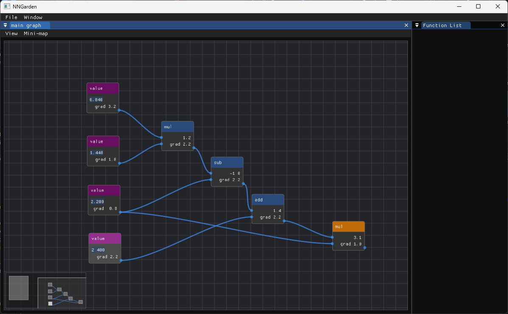

# NNGarden

A WIP toy to play around with visual representations of computation graphs. Does somewhat fast automatic differentiation on them, if you right click a node and ask to do a backwards pass from that node. You can also save graphs, and collapse parts of your graph into re-usable "functions".



## How to build

```
git submodule update --init --recursive
mkdir build
cd build
cmake ..
```